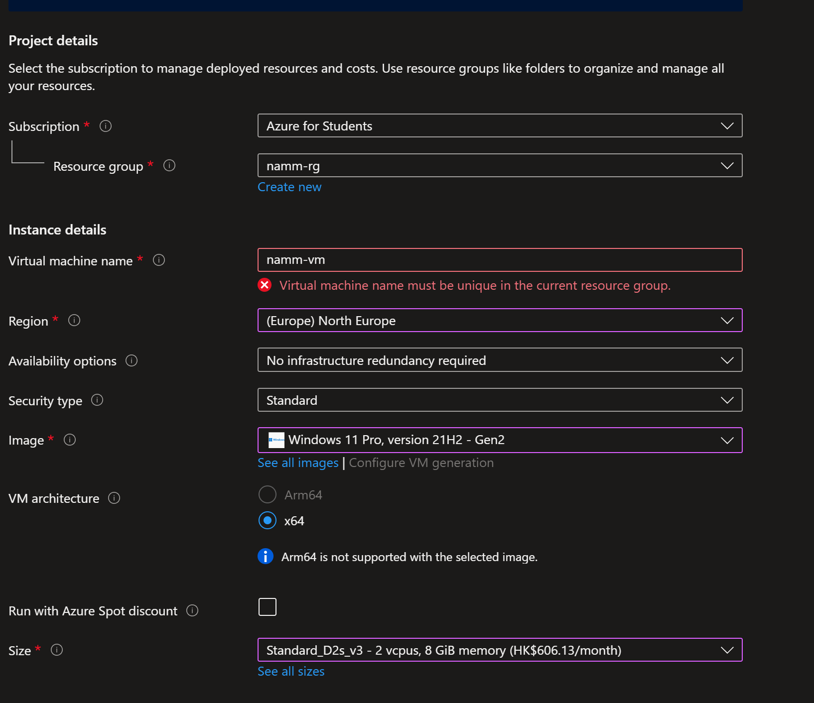
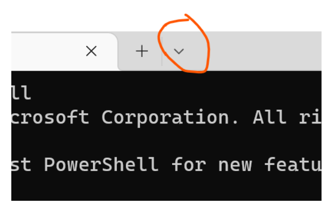

# SISSEJUHATUS 

Tänase praktikumi teemaks on Azure keskkonnas Windows 11 virtuaalmasina loomine, sellega ühendumine ja sinna peale WSL-i (Windows SubSystem for Linux)  installimine. Lisaks tutvutme ka pilveteenuste ja Azurega.

Siiamaani, kasutasime VM kohalikus masinas. Nüüd tekitame olukorra, kus see on üles seatud pilveteenuses - See tähendab, et teie virtuaalmasin on üles seatud kusagil serveripargis, mille asupaiks võib olla teist tuhandete kilomeetrite kaudusel. See ongi enamasti virtuaalmasinate põhiline kasutusjuht ning ka väärtus, kuna võimaldab efektiivsemat ressursside haldamist ning lisaks ka stabiilsemat keskkonda.  

**NB! Kuna tänases praktikumis kasutate tasulisi ressursse piiratud Azure krediidiga, siis Väga oluline on, et te lülitate oma pilveteenuses asuva virtuaalmasina välja iga kord pärast selle kasutamist. Vastasel juhul lõppeb teil endal tasuta kasutatav ressurss ning ei ole võimalik praktikumi lõpuni teha**

# Sammude kokkuvõte

# Mis on pilveteenus?

## Pilveteenustest Üldiselt 

A Otsige Internetist arvutimaailmas laialt tuntuks saanud pilveteenuse kohta infot ja vastake oma praktikumiaruandes järgnevatele küsimustele:

1. $\color{blue}{\textrm{Nimetage 3 kõige suuremat pilveteenuste pakkujat}}$
2. $\color{blue}{\textrm{Nimetage 5 eelist, mis on pilveteenustel võrreldes enda teenuste füüsilistel masinatel majutamisega?}}$
3. $\color{blue}{\textrm{Nimetage 3 situatsiooni, kus pole pilveteenuse kasutamine mõistlik?}}$
4. $\color{blue}{\textrm{Mis on vahet IAAS ja SAAS ja PAAS tenustel?}}$
5. $\color{blue}{\textrm{Kas teate ka mõnda Eesti ettevõtet, kes pakub pilves IAAS hostimise teenust?}}$

## Azure pilveteenus

B Kasutades Internetti, vastake nendele küsimustele. **PS, tehke endale vastused korralikult selgeks, sest neid läheb teil ka ülejäänud praktikumi jooksul vaja.**

1. $\color{blue}{\textrm{Mis on Azure Resource Group}}$
2. $\color{blue}{\textrm{Mis on Azure Subscription}}$
3. $\color{blue}{\textrm{Mis on Azure Resource}}$

# Ülikooli kasutajaga konto loomine 

+ [Link konto tegemiseks on siin olemas. Ärge kohe sisse logige, vaid vajutage "Start for free"](https://azure.microsoft.com/en-us/free/students/)

+ Pange tähele, et te ülikooli kasutajaga peate te ainult kinnitama ära, et olete ülikooli tudeng. 
+ [Juhised inglise keeles konto tegemiseks](https://dev.to/esdanielgomez/creating-azure-for-students-account-48g)

## Sammud üldiselt

1. Vajutage "Start free"
2. Logige sisse oma olemasoleva Microsoti kontoga. Ei pea ilmtingimata oleme teie ülikooli konto. 
3. Kinnitaga oma isik telefoninumbriga 
4. Kinnitage oma õpilase staatus enda ülikooli kontoga. Teie ülikooli konto on <ut_kasutajanimi>@ut.ee.
5. Pärast enda õpilase staatuse kinnitamist juhatatakse teid edasi teie [Azure keskvaatesse](http://portal.azure.com/) (inglise k. "Azure Console","Azure Graphical User Interface")
6. Palju õnne! Nüüdseks on teil olemas oma Azure konto koos aastase 100 $ krediidiga. Lisaks saate kasutada ka mitmeid erinevaid teenuseid tasuta. [Lugege lähemalt siit](http://portal.azure.com/)

# Azure pilveteenuses Virtuaalmasina loomine 

1. Minge aadressile https://portal.azure.com/ 
2. Avanenud vaates otsige üles sinine "Pluss" ikoon kirjaga "Create a resource" ja vajutage sellele
3. Avanenud vaates otsige üles kirje "Virtual machine" ja vajutage sellele 

4. Avaneb virtuaalmasina loomise vaade. 

## VIRTUAALMASINA LOOMINE 

**Oluline oleks selle ja järgmise paragrahvi sammul (VIRTUAALMASINA LOOMINE) mitte praktikumi katkestada, sest vastasel juhul loob Azure VMi valmis ja paneb selle ka käima, see omakorda põhjustab aga lisakulu.** 

Virtuaalmasina loomiseks täitke ära avanenud vaade nii nagu pildil näidatud. **Asendage nimi "namm" enda perekonnanimega ilma täpitähtedeta.** 
**Väga oluline on, et jätata ka oma lisatud parooli ja kasutajanime meelde. Teil läheb seda vaja VMi sisselogimisel**

Edasi vajutaga nupule: "Next: Disks"

+ Valige OS diskiks "Standard HDD (locally-redundant storage)"
+ Tehke linnuke väljale "Delete with VM"

Edasi vajutaga nupule: "Next: Networking"

+ Kui seda juba tehtud pole, siis tehke linnuke väljale "Delete public IP and NIC when VM is deleted"

Edasi vajutage nupule "Review + create". Edasi peaks teile tekkima akna üles roheline tekst "Validation passed". Kui nii on, siis vajutage sinisele nupule "Create". 

+ Virtuaalmasina loomine võtab aega kuskil 5-15 minutit. Võite nii kaua lugeda WSL-i kohta https://en.wikipedia.org/wiki/Windows_Subsystem_for_Linux
+ Minge lingile https://portal.azure.com/#home
+ Vajutage nupule "Resource Groups"
+ Avanenud vaates vajutage resource grupile nimega &lt;perekonnanimi>-rg
+ Vajutage oma vm-i peale
  
  

$\color{blue}{\textrm{Peaks avanema teie loodud VMi üldinfot tutvustav vaade. Tehke sellest kuvatõmmis }}$

Näide - PS! mul on andud parameetrid natuke teise

+ Edasi otsige virtuaalmasina menüüst vasakult käelt üles "Auto-Shutdown" ja seadistage see "Enabled" olekusse. **Veenduge, et antud valik ka salvestuks.** !!PS Kui te ei saa salvestada muudatust, siis tehke browseris refresh - vajadusel mitu korda. 
 

$\color{blue}{\textrm{Tehke kohast, kus on näidatud, et teil on Auto Shutdown enablitud kuvatõmmis}}$ 

Veenduge, et teie loodud virtuaalmasin oleks käivitatud. Kui pole, siis käivitage see. 

# VIRTUAALMASINAGA ÜHENDUMINE

+ Kui virtuaalmasin on käivitatud, siis virtuaalmasina infovaates vajutage nupule "Connect" ja avanenud menüüst valige RDP.
+ Avaneb uus aken. Vajutage seal nupule "Download RDP File". Teile laetakse alla fail &lt;perenimi>-vm.rdp. 
+ Nüüd on teil mitu võimalust ühenduda Remote Connectioniga pilveteenuses olevasse virtuaalmasinasse. Soovitame esmalt proovida ühendumiseks teie enda host süsteemi.
+ Kui kasutate Windows 10, Windows 11 arvutit või Windows 11 lokaalselt virtuaalmasinat
   + Klõpsake alla laetud failile &lt;perenimi>-vm.rdp. Aknas peaks avanema autentimisvaade. Klõpsake seal valikul "Use a different account" ja sisestaga oma **varemloodud kasutajanimi ja parool**  
+ Kui kasutate mõnda muud operatsioonisüsteemi https://learn.microsoft.com/en-us/windows-server/remote/remote-desktop-services/clients/remote-desktop-clients
+ Voila, olete ühendunud oma pilves asuvasse virtuaalmasinasse. 
+ $\color{blue}{\textrm{Tehke enda virtuaalmasinas Settings->System->About vaatest kuvatõmmis}}$

# WSL

## SISSEJUHATUS WSL-i

Tänase praktikumi üheks teemaks on ka WSLi (Windows Substystem For Linux) installimine Azure pilve loodud virtuaalmasinasse.  WSL pakub teile võimalust Windowsi keskkonnas seada üles täisfunktsionaalsusega Linuxi terminal vastavalt teie soovile kas Ubuntu, Debiani või mingi muu distroga.

Esmalt [Lugege läbi WSLi teemaline postitus](https://blogs.windows.com/windowsdeveloper/2016/07/22/fun-with-the-windows-subsystem-for-linux/) ja $\color{blue}{\textrm{ Pange kirja 3 kasutegurit WSLi juures}}$

## WSL-i INSTALLIMINE LOODUD VIRTUAALMASINA PEALE 

+ Installige antud juhendi järgi enda Virtuaalmasina peale [WSL](https://learn.microsoft.com/en-us/windows/wsl/install)
  + By default installitakse teile WSL koos Ubuntuga
+ Taaskäivitage arvuti 

## WSL-i KATSETAMINE 

+ Pärast taaskäivitamist tuleb teil sisestada enda kasutajanimi. Pange selleks enda perekonnanimi ilma täpitähtedeta.
+ Käivitage WSL ja proovige selles sisestada mõned Linuxi käsud 

~~~sh
ls -la
pwd
uname -a
~~~
+ $\color{blue}{\textrm{Tehke kuvatõmmis sellest, kui olete listinud WSL-is enda kodukusta sisu}}$

## SSHga Tartu ülikooli serverisse 

+ WSL on tihtilugu mugavam kasutada kui on vaja kuhugi ssh-ga sisse logida. Logige sisse Tartu Ülikooli serverisse ssh-ga
~~~sh
ssh -oHostKeyAlgorithms=+ssh-dss ut_kasutaja@math.ut.ee
~~~
+ Et antud protsessi lihtsamaks teha, tuleks luua alias 
~~~sh
alias logiut='ssh -oHostKeyAlgorithms=+ssh-dss ut_kasutaja@math.ut.ee'
logiut
~~~
+ Et logiut, ka edaspidi teid math.ut.ee serverisse logiks, siis lisage ~/.bashrc faili lõppu aliase tekitamise käsk. 

## WSLI AVAMISE VÕIMALUSE 

Proovige läbi mitu erinevat võimalust enda remote virtuaalmasinas avada WSL
+ Avage Virtuaalmasin otsing ja kirjutage otsingusse "Ubuntu". Selle peale avaneb teile WSLi aken
+  Avage Virtuaalmasin otsing ja kirjutage otsingusse Terminal Powershelliga, klikake nüüd uue tabi avamise valikute nupule  ning valige sealt valik Ubuntu.

## ÜLESANNE

Läksin puhkusele ja talletasin enda paroolid failidesse siin Giti repos https://github.com/AndresNamm/accident. Mõtlesin, et kui ma teen palju faile, siis keegi ei leia minu parooli üles. Nii juhtuski, sest ma ei mäleta, millistesse failidesse ma oma paroolid panin. Palun teilt abi. 

1. Kloonige antud repo endale WSLiga kodukausta
2.  $\color{blue}{\textrm{Leidke üles minu talletatud paroolid. PS! need on talletatud ainult md failidesse. }}$ - Valige sealt Ubuntu. 

# VIRTUAALMASINA SULGEMINE

+ Minge aadressile: https://portal.azure.com/#home
+ Otsige üles oma loodud virtuaalmasin  

Veenduge, et teie virtuaalmasinal oleks toodud välja "Status: Stopped (deallocated)"

# [!!!! Tagasiside praktikumile](https://forms.office.com/r/S7rLfwzKe4)

# PRAKTIKUMI KOKKUVÕTE ESITAMISEKS

Vastused tuleb ikka nagu tavalisele esitada praktikumi [courses.cs.ut](https://courses.cs.ut.ee/2022/os/fall/Main/Praktikum12) lehel

## KÜSIMUSED

1. $\color{blue}{\textrm{Nimetage 3 kõige suuremat pilveteenuste pakkujat}}$
2. $\color{blue}{\textrm{Nimetage 5 eelist, mis on pilveteenustel võrreldes enda teenuste füüsilistel masinatel majutamisega?}}$
3. $\color{blue}{\textrm{Nimetage 3 situatsiooni, kus pole pilveteenuse kasutamine mõistlik?}}$
4. $\color{blue}{\textrm{Mis on vahet IAAS ja SAAS ja PAAS tenustel?}}$
5. $\color{blue}{\textrm{Kas teate ka mõnda Eesti ettevõtet, kes pakub pilves IAAS hostimise teenust?}}$
6. $\color{blue}{\textrm{Mis on Azure Resource Group}}$
7. $\color{blue}{\textrm{Mis on Azure Subscription}}$
8. $\color{blue}{\textrm{Mis on Azure Resource}}$
9. $\color{blue}{\textrm{Tehke VM loomise vaatest screenshot }}$ Näidis 1
10. $\color{blue}{\textrm{Tehke kohast, kus on näidatud, et teil on Auto Shutdown enablitud kuvatõmmis}}$
11. $\color{blue}{\textrm{Tehke enda virtuaalmasinas Settings->System->About vaatest kuvatõmmis}}$
12. $\color{blue}{\textrm{Pange kirja 3 kasutegurit WSLi juures}}$
13. $\color{blue}{\textrm{Tehke kuvatõmmis sellest, kui olete listinud WSL-is enda kodukusta sisu}}$
14. $\color{blue}{\textrm{ÜLESANNE: Leidke üles minu reposse talletatud paroolid. PS! need on talletatud ainult md failidesse. }}$

## KUVATÕMMISTE NÄITED

Näidis 1

