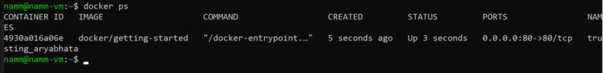
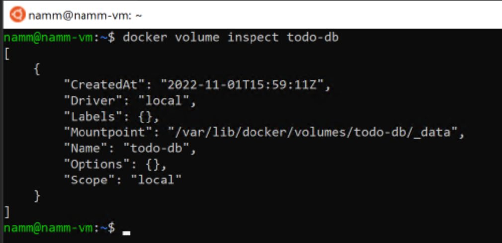
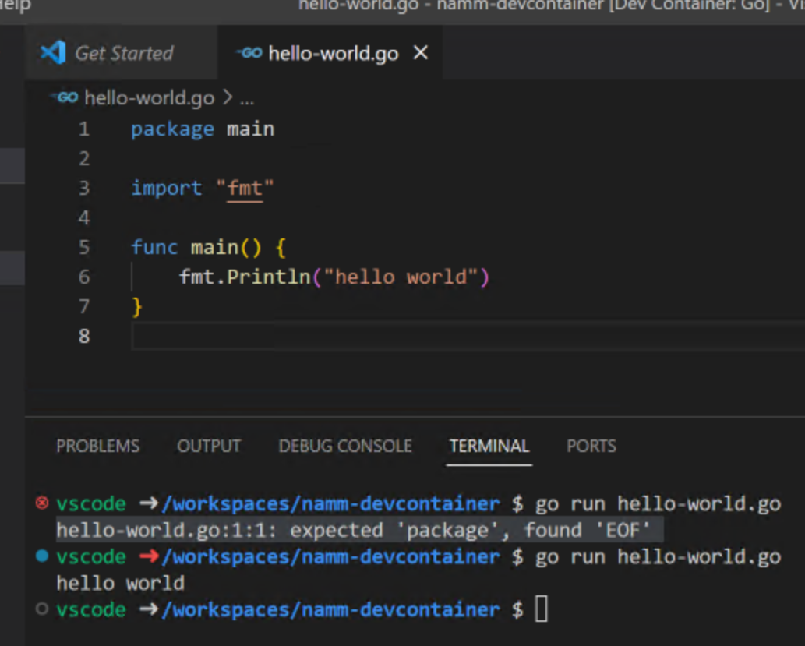

# SISSEJUHATUS 

Olete kunagi kuulnud kedagi ütlemas, see töötas minu arvutis. Olete te kunagi näinud roppu moodi vaeva, et saada enda arvutis käima arenduskeskkond mingile projektile. 
Olete kunagi teinud serveris mingeid muudatusi nii, et nendest muudatustest enam tagasi liikuda ei saa. Tänase praktikumi eesmärk on need probleemid elimineerida või vähemalt selliste probleemide hulka võimalikult palju vähendada. 

Tänase praktikumi teema on Docker, Visual Studio Code, Visual Studio Code devcontainers, ja Azures Container Instances. 

+ **Esmalt ühendage oma eelmises praktikumis loodud Azures pilves oleva virtuaalmasinaga**. Kõik edasised sammud toimuvad seal.  Omal vastutusel võite proovida antud praktikumi ka enda arvutis läbi teha, kuid seal on raske garanteerida, et teil kõik asjad töötavad nii nagu meil. Selleks peate te endale te ka ise WSL-i üles seadma. Selleks võite abi saada eelmise praktikumi materjalidest.  

# INSTALLIME VSCODE 

## WINDOWS

+ [Lae alla ja installi vscode Windowsis](https://code.visualstudio.com/)

+ [Installige endale Visual Studio Code Remote Development Extension Pack](https://marketplace.visualstudio.com/items?itemName=ms-vscode-remote.vscode-remote-extensionpack)

### WSL 

+ Ava WSLi terminal
+ Klooni endale WSLis kodukausta repo https://github.com/AndresNamm/dockertest.git
+ Mine kloonitud Githubi kausta 
+ Sisesta käsk 
~~~sh
code .
~~~
+ **PS** - kui viimane käsk hangub, siis lihtsalt sulgege terminal ja avage uuesti. 
+ Nüüd peaks avanema vscode aken. Võite selle akna sulgeda. 
+ Edaspidi saate samamoodi vscode avada. 

# DOCKER 

+ [Installida Docker desktop antud juhendi järgi](https://docs.docker.com/desktop/install/windows-install/)
+ Vaadake, et mõlemad linnukesed oleksid tehtud nagu alloleval pildil. **Eriti oluline on WSLi puudutav osa**

+ Käivitage Docker 
+ Googeldage natuke Dockeri kohta lisainfot ning proovige endale selgeks teha põhiinfo Dockeri kohta. Näiteks lugege läbi [see tutorial](https://www.guru99.com/docker-tutorial.html)
+ $\color{DodgerBlue}{\textrm{Defineerige, mis on Dockerfile, Docker image, Docker container. Mis on neil vahet?}}$

# TESTIME DOCKERIT 

+ Avage nüüd uuesti WSLi aken 
+ Sisestage käsk
~~~sh
docker ps
docker images 
~~~
+  **PS, kui saate Got Permission Denied while trying to connect to the docker daemon...** , siis sulgege oma Ubuntu/WSL terminal ja avage see uuesti. Vajadusel tehke kogu arvutile restart. 

+ Nüüd sisestage käsk
~~~sh
docker run -d -p 80:80 docker/getting-started
~~~~
+ Kontrollige jooksvaid dockeri konteinereid
~~~sh
docker ps
~~~

+ $\color{DodgerBlue}{\textrm{Tehke screenshot docker ps väljundist, nii, et oleks näha teie kasutajanimi}}$
+ Kontrollige oma alla laetud dockeri imagei'd 
~~~sh
docker images
~~~

+ Edasi Minge aadressile http://localhost/tutorial/ Seal asub teie käivitatu Docker image
+ Järgige nüüd sealt avanenud tutorialit ning tehke läbi tutoriali osad "Getting Started","Our Application","Sharing our app", "Persisting our DB"

## DOCKERI TUTORIALI TÄPSUSTAVAD SAMMUD 

### Our Application

+ Laadige alla zip fail. 

+ Avage WSL ja kopeerige allalaetud app.zip kaust endale WSLi kodukausta 
+ Pakkige app.zip lahti ja minge kausta ning avage vscode

~~~sh
sudo apt install unzip
unzip app.zip
cd app/
code .
~~~
+ Avage terminal vscode aknas: Terminal -> New Terminal. Nagu näete, on WSL avanenud ka vscode sees.
+ Edasi järgige tutorialit nii nagu juhises kirjas. Tehke lõpuni sammud "Getting Started", "Our Application" ja "Updating our APP", "Sharing our App" ja "Persisting data". Soovitame soojalt teha läbi ka järgmised sammud, aga see ei ole kohustuslik

+ $\color{DodgerBlue}{\textrm{Tehke screenshot, kus on näha todo app jooksmas teie veebibrauseris ja terminal koos teie kasutajanimega}}$
 

### Sharing our app

+ Kui samm "Play with Docker" ei õnnestu, siis jätke see lihtsalt vahele
+ $\color{DodgerBlue}{\textrm{Mis on "Sharing our app" sammu mõte? Mida see samm demonstreerib?}}$

### Persisting our DB

+ Selle sammu eesmärk on näidata, kuidas on võimalik mitme erineva Dockeri image vahel jagada faile jms. 
+ $\color{DodgerBlue}{\textrm{Tehke screenshot käsu 'docker volume inspect todo-db' väljundist.}}$

# AZURE CONTAINER INSTANCES

+ Mäletatavasti tegite endale eelmises praktikumis Azure konto. Tänases praktikumis kasutame seda jälle. 

[Järgnevad sammud on pandud kirja selle tutoriali pinnalt. Kui kuskil jänni jääte, siis saate lisainfot juurde otsida.](https://docs.docker.com/cloud/aci-integration/)

+ Selgitage välja oma [Ülikooli Subscription ID selle juhendi järgi](https://learn.microsoft.com/en-us/azure/azure-portal/get-subscription-tenant-id)
+ Eelnevalt tuleb teil endal resource-group luua. Kasutame selleks azure cli-d. Selleks, et seda kasutada, tuleb ta **WSLi** installida [selle juhendi järgi](https://learn.microsoft.com/en-us/cli/azure/install-azure-cli-linux?source=recommendations&pivots=apt). 
+ Kui olete endal Azure CLI installinud, siis kõigpeale logige oma ülikooli kontoga enda Azure-sse sisse. Avaneb prompt, kus teil tuleb oma Azure kontoga sisse logida. 
~~~sh
az login
~~~
+ Valige endale active Azure Subscription. See, mis te enne üles otsisite.
~~~sh
AZURE_SUBSCRIPTION="xxxxxxxx-xxxx-xxxx-xxxx-xxxxxxxxxxxx"
az account set --subscription $AZURE_SUBSCRIPTION
~~~~
+ Pärast sisselogimist saate endal luua uue resource groupi.
~~~sh
az group create --location norwayeast --name <perenimi>-ci
~~~
+ Logi dockeriga Azure sisse

~~~sh
docker login azure
~~~
+ Peaks avanema autentimis aken. Logige seal oma Azure kontoga sisse.

+ Nüüd saate endal Dockeri konteksti luua. [Mis on Dockeri kontekst?](https://docs.docker.com/engine/context/working-with-contexts/)

+ $\color{DodgerBlue}{\textrm{ Tehke selgeks, millist Dockeri konteksti te parasjagu kasutate?}}$

~~~
RESOURCE_GROUP= <perenimi>-ci
docker context create aci --subscription-id $AZURE_SUBSCRIPTION --resource-group $RESOURCE_GROUP --location norwayeast <perenimi>-aci
~~~

+ Jooksuta nüüd test dockeri imaget Azure pilves 

~~~sh
docker context use <perenimi>-aci
docker run -p 80:80 nginx
~~~

+ See Samm võtab nüüd aega. Ärge seda praegu ära canceldage.
+  $\color{DodgerBlue}{\textrm{Edasi tuleb teil Azure portalis üles leida tekkinud Dockeri konteiner ja sellest Screenshot teha nagu praegune näide näitab}}$
 

+ Antud lehel on kättesaadav ka docker konteineri Public IP. Minge oma veebibrauseriga sellele aadressile. Peaks avanema nginx veebiserveri "Hello world näide". Palju õnne, olete oma esimese Dockeri image laiale avalikusele deploynud.

+ Vaadake nüüd jooksvaid dockeri konteinereid

~~~sh
docker ps
~~~

+ Leidke väljundist CONTAINER ID ja 

~~~sh
docker stop <CONTAINER_ID>
docker rm <CONTAINER_ID>
~~~ 

+ Kontrollige nüüd Azure veebiportaalist, kas Dockeri konteiner on seal ikka alles või on sealt eemaldatud?
+ Vahetage nüüd dockeri kontekst tagasi enda masina Dockeri konteksti peale  peale. 
~~~
docker context list
docker context use default
~~~

# VISUAL STUDIO CODE CONTAINERS

Selle sammu eesmärk on teha teie arenduskeskkond 100 % reprodutseeritavaks mõne klikiga. Tavaliselt võtab uue ettevõtte/projektiga liitudes väga pikalt aega arenduskeskkonna üle seadmine. Visual Studio Code devcontainerid lubavad teil üles ehitada oma arenduskeskkonnad Dokcer konteineri põhjal. See tähendab, et arenduskeskkond on 

1. Alati reprodutseeritav
2. Lihtne üles seada
3. Võimalikult sarnane produktsioonikeskkonnaga. 

## DEVCONTAINERI ÜLES SEADMINE

+ Sulgege nüüd VsCode
+ Avage uuesti Ubuntu WSL
+ Tekitage kodukausta uus kaust nimega perenimi-devcontainer

~~~sh
cd <perenimi>-devcontainer
code . 
~~~

+ Avanenud vscode aknase vajutage klaviatuuril CTRL+SHIFT+P või valige View->Command Palette
+ Avanenud aknas kirjutage nagu allolevas screenshotis näidatud on

 
+ Avaneb menüü koos otsingukastiga. Kirjutage sinna "go" ja valig "Go devcontainers"

+ Avaneb devcontainer.json fail. 

+ Avage küljelt menüüs kaust ".devcontainer". Seal on ka Dockerfile, mis kirjeldab milliset arenduskeskkonda te dockeris tahata. Antud näide on GO-le suunatud. Seda on võimalik ka kohandada vastavalt vajadusele ning git-i commitida, et uus arendaja saaks endale täpselt sama arenduskeskkonna. 
+ Vajutage uuesti CTRL+SHIFT+P
+ Valige Dev Containers: Rebuild and Reopen in Container. Kui tuleb error, et Docker ei jookse, siis tehke läbi allolevad sammud ja proovige uuesti

1. Kontrollige, et Docker Desktop oleks käivitatud. Kui on 
2. Tehke Docker Desktopile restart

+ Nüüd tõmmatakse alla kõik vajalikud Dockeri imaged. Natukese aja pärast peaks avanema teil GO arenduskeskkond. 

+ Kopeeriga endale nüüd siit GO keele näide alla https://gobyexample.com/hello-world ja tehke enda arenduskeskkonda uus fail hello-world.go ja jooksutage seda nagu näites näidatud
  
 
+ $\color{DodgerBlue}{\textrm{Tehke screenshot jooksnud GO programmist koos terminaliga}}$
+ Kui saate sellise errori: 'hello-world.go:1:1: expected 'package', found 'EOF'', siis **mõelge**, kus võib error olla. 
+ Go installiti ainult Dockeri konteineri sisse. See on täiesti isoleeritud teie ülejäänud VMist. 

# LÕPPSAMMUD 

+ Minge nüüd portal.azure.com. Otsige oma resource grupid üles ja eemaldage kõik loodud ressursid. 

+ Valige kõik ressursid. Ning eemaldage need. 

+ Vajutage mõlema resource groupi puhul"Delete Resource Group"

# KÜSIMUSED

1. Defineerige, mis on Dockerfile, Docker image, Docker container. Mis on neil vahet?
2. Tehke screenshot docker ps käsu väljundist, nii, et oleks näha teie kasutajanimi
3. Tehke screenshot, kus on näha todo app jooksmas teie veebibrauseris ja terminal koos teie kasutajanimega
4. Mis on "Sharing our app" sammu mõte? Mida see samm demonstreerib??
5. Tehke screenshot käsu 'docker volume inspect todo-db' väljundist.
6. Tehke selgeks, millist Dockeri konteksti te parasjagu kasutate?
7. Edasi tuleb teil Azure portalis üles leida tekkinud Dockeri konteiner ja sellest Screenshot teha nagu praegune näide näitab
8. Tehke screenshot jooksnud GO programmist koos terminaliga
 
# SCREENSHOTID

## 2

## 3 

## 5

## 7 

## 8 

# [!!!! Tagasiside praktikumile](https://forms.office.com/r/S7rLfwzKe4)

# LISATEEMAD 

Kui teile antud teema huvi pakkus, siis soovitame googeldada ka selliste teemade kohta:

+ Docker Compose
+ Docker Networking
+ Kubernetes
  + Helm 
  + AWS ECS
  + Azure AKS
  + Gcp Kubernetes
  + DigitalOcean Kubernetest 
